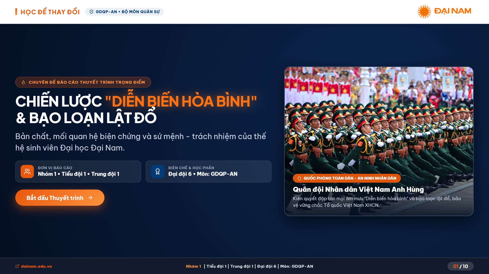
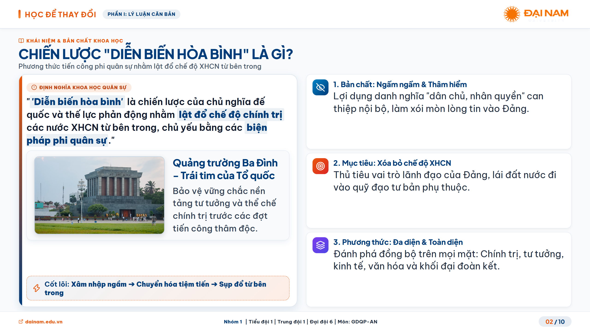
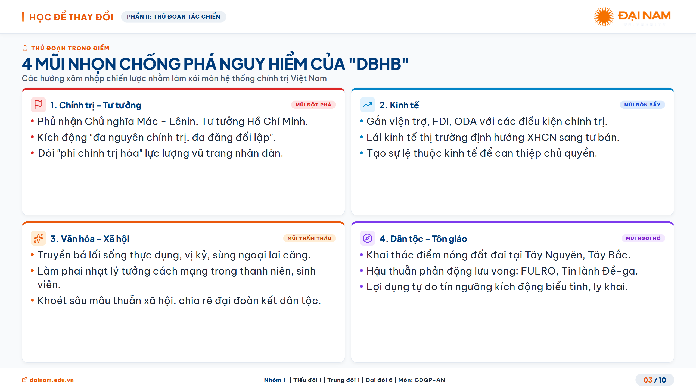
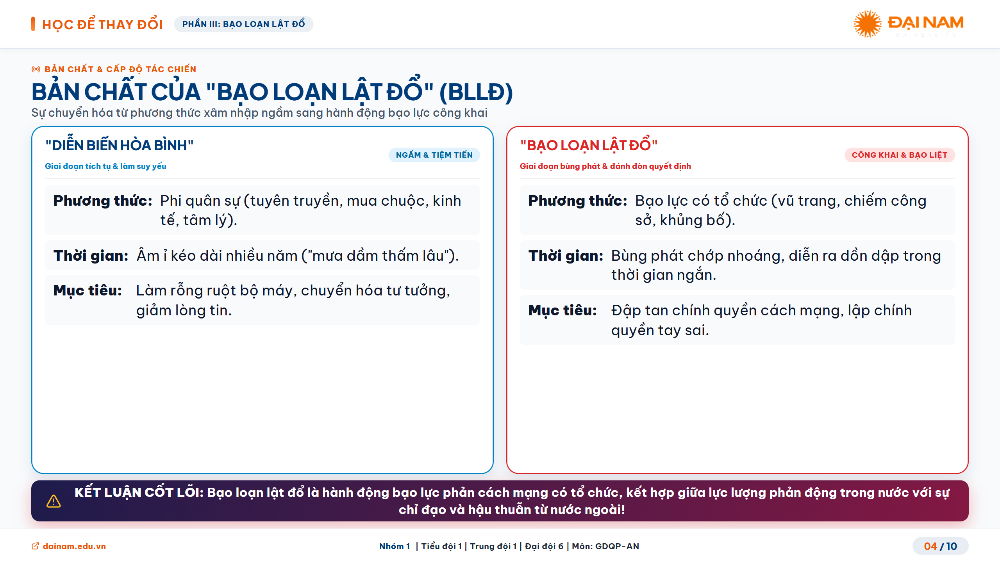
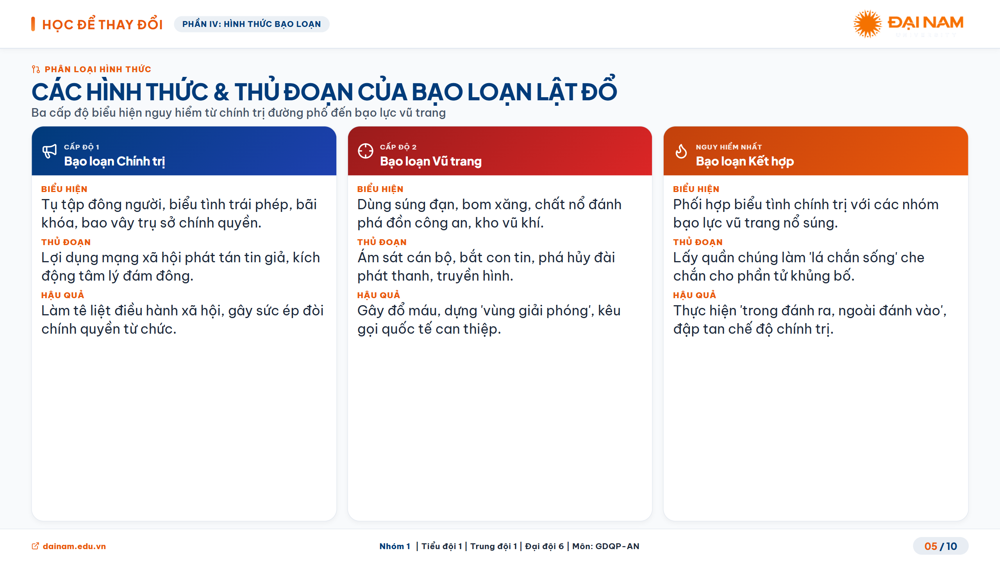
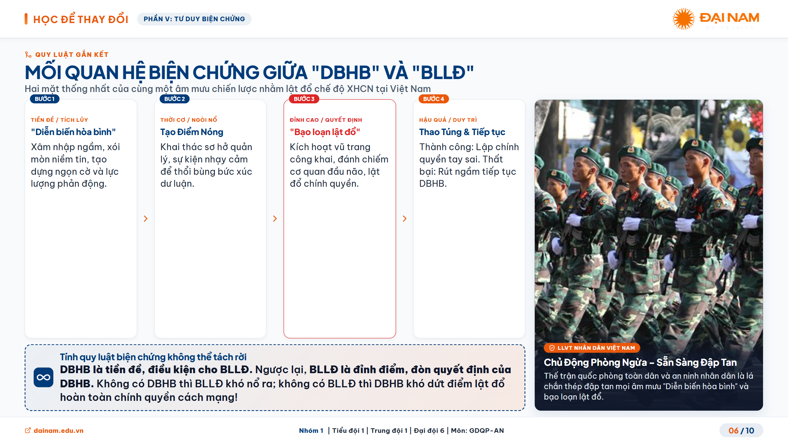
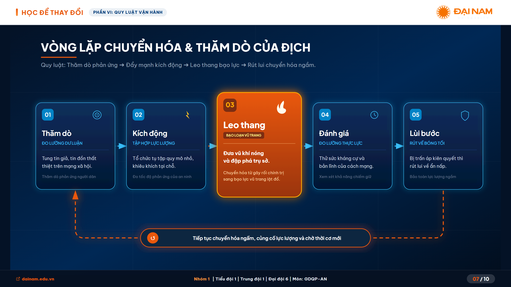
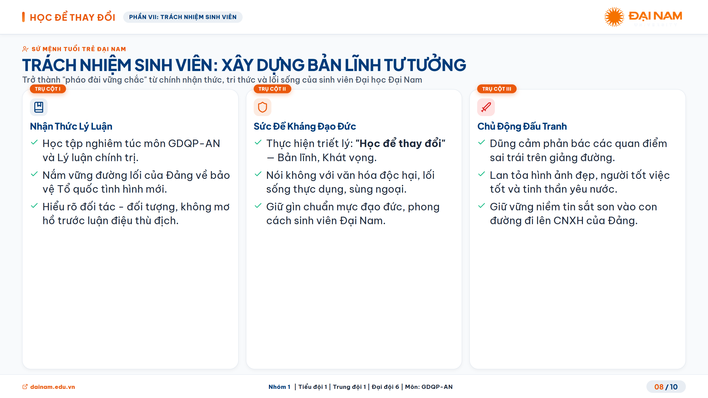
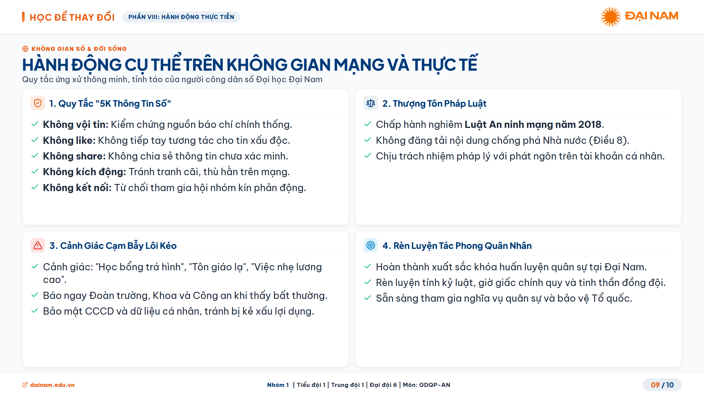
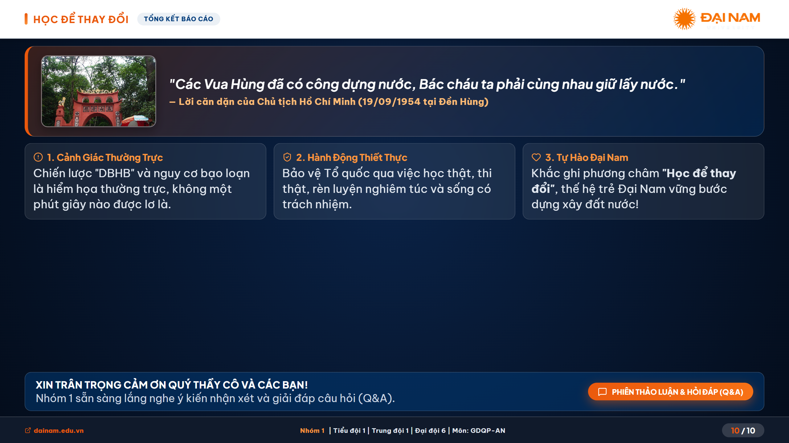

# BÁO CÁO THUYẾT TRÌNH GIÁO DỤC QUỐC PHÒNG & AN NINH
## Chuyên Đề: Chiến Lược "Diễn Biến Hòa Bình" & Bạo Loạn Lật Đổ
> **Đơn vị thực hiện:** Nhóm 1 • Tiểu đội 1 • Trung đội 1 • Đại đội 6  
> **Đơn vị đào tạo:** Trường Đại học Đại Nam (DNU)  
> **Khẩu hiệu:** "HỌC ĐỂ THAY ĐỔI"

---

## 🌐 LINK TRÌNH CHIẾU TRỰC TUYẾN (LIVE WEB DEMO)
👉 **Truy cập bài thuyết trình tương tác trực tiếp:**  
**[https://thehilichurl.github.io/Slide_QPAN/](https://thehilichurl.github.io/Slide_QPAN/)**

---

## 📥 TẢI VỀ BẢN XUẤT 2K SIÊU NÉT (PPTX & PDF)
Toàn bộ 10 slide đã được xuất bằng cơ chế **Canvas 2K QHD (2560 x 1440 px)**, tự động loại bỏ giao diện điều khiển web và đồng hồ bấm giờ, sẵn sàng cho việc trình chiếu hoặc in ấn:

- 📊 **PowerPoint Presentation (16:9 Widescreen):**  
  👉 **[Tải file PPTX (2K)](./Thuyet_Trinh_QPAN_DaiNam_2K.pptx)** *(~7.3 MB)*
- 📄 **Tài liệu PDF Khổ ngang (16:9 Landscape):**  
  👉 **[Tải file PDF (2K)](./Thuyet_Trinh_QPAN_DaiNam_2K.pdf)** *(~3.1 MB)*

---

## 🎯 CÁC TÍNH NĂNG NỔI BẬT

1. **Định danh thương hiệu Đại học Đại Nam:**
   - Slogan *"HỌC ĐỂ THAY ĐỔI"* nổi bật trên thanh header cùng logo nhận diện chuẩn.
   - Tone màu nhận diện cam Đại Nam (`#F37021` / `#EA580C`) kết hợp xanh Cobalt quân sự (`#003B7A`).
   - Thanh footer hiển thị định danh nhóm, môn học và liên kết chính thức `dainam.edu.vn`.

2. **Giao diện tối ưu máy chiếu (Projector-Optimized):**
   - Không gian chuẩn tỷ lệ 16:9 (`1920x1080`), tự động co giãn (`transform: scale`) tương thích mọi độ phân giải màn hình.
   - Typography cỡ lớn (28px - 34px), tương phản cao, dễ quan sát từ khoảng cách xa.

3. **Công nghệ xuất bản kép Canvas 2K:**
   - Chụp tự động từng slide ở độ phân giải 2K (2560x1440).
   - Tự động đóng gói thành file **PPTX** và **PDF** ngay trên trình duyệt với thanh tiến trình trực quan.
   - Tuyệt đối không chụp dính nút điều hướng HUD, thanh tiến độ hay bộ đếm thời gian.

4. **Hệ thống phím tắt thuyết trình chuyên nghiệp:**
   - `→` / `Phím cách (Space)` / `PageDown`: Chuyển sang slide tiếp theo.
   - `←` / `PageUp`: Quay lại slide trước.
   - `F`: Bật / Tắt chế độ Toàn màn hình (Fullscreen).
   - `H`: Bật / Tắt chế độ Tập trung (Focus Mode - ẩn toàn bộ thanh HUD).
   - `?`: Mở bảng hướng dẫn phím tắt.

---

## 📋 NỘI DUNG 10 SLIDE CHI TIẾT

| Slide | Chủ Đề | Nội Dung Trọng Tâm |
| :---: | :--- | :--- |
| **01** | **Bìa Thuyết Trình** | Khối duyệt binh QĐNDVN anh hùng, thông tin chuyên đề & đơn vị báo cáo. |
| **02** | **Bản Chất DBHB** | Định nghĩa chiến lược phi quân sự và 3 mục tiêu tối thượng của các thế lực thù địch. |
| **03** | **Quy Luật Bạo Loạn** | Khái niệm bạo loạn lật đổ, hình thức biểu hiện và nguyên tắc xử lý dứt điểm. |
| **04** | **Tiến Trình Lịch Sử** | 3 giai đoạn chuyển biến chiến lược từ 1945 đến nay. |
| **05** | **3 Đòn Tấn Công** | Đòn bao vây cấm vận, bình thường hóa thâm nhập và chuyển hóa toàn diện. |
| **06** | **5 Mũi Nhọn Phá Hoại** | Mũi nhọn Chính trị, Kinh tế, Tư tưởng - Văn hóa, Dân tộc - Tôn giáo, QPAN. |
| **07** | **Sơ Đồ Vòng Lặp Bạo Loạn** | Quy trình 5 bước: Thăm dò → Kích động → Leo thang → Đánh giá → Lùi bước ngầm. |
| **08** | **3 Trụ Cột Phòng Thủ** | Xây dựng Đảng vững mạnh, Thế trận lòng dân, Lực lượng vũ trang tinh nhuệ. |
| **09** | **Trách Nhiệm Sinh Viên** | Bản lĩnh chính trị, Văn hóa không gian mạng chuẩn mực và tinh thần Học để thay đổi. |
| **10** | **Tổng Kết & Thông Điệp** | Lời dạy của Bác Hồ tại Đền Hùng và thông điệp hành động tuổi trẻ Đại Nam. |

---

## 🖼️ XEM TRƯỚC HÌNH ẢNH 10 SLIDE (CANVAS 2K)

### Slide 01: Bìa Báo Cáo Thuyết Trình

### Slide 02: Khái Niệm & Bản Chất Diễn Biến Hòa Bình

### Slide 03: Quy Luật Bạo Loạn Lật Đổ

### Slide 04: Tiến Trình Lịch Sử Phát Triển Của Chiến Lược

### Slide 05: 3 Đòn Tấn Công Trọng Tâm Đối Với Việt Nam

### Slide 06: 5 Mũi Nhọn Chống Phá Đa Chiều

### Slide 07: Sơ Đồ Vòng Lặp Chuyển Hóa & Thăm Dò Của Địch

### Slide 08: 3 Trụ Cột Phòng Thủ Chiến Lược

### Slide 09: Trách Nhiệm Thế Hệ Trẻ - Sinh Viên Đại Học Đại Nam

### Slide 10: Tổng Kết & Thông Điệp Lời Bác Dặn Tại Đền Hùng

---
*© 2026 Nhóm 1 • Tiểu đội 1 • Trung đội 1 • Đại đội 6 • Môn GDQP-AN • Trường Đại học Đại Nam.*
